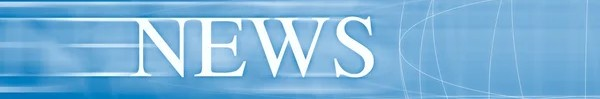

      

<h1 align="center">
      SEARCH NEWS
      
</h1>

## About
This application is created to search for news by your
request, and also shows the main news of Ukraine and such
categories as: sports, business, health, technology, science and entertainment.

## Technology stack

  
  
  
  
  
  

### Developers:
[Kirill Larionov (GitHub)](https://github.com/kirlarionov)
___
##### [
Back to top &#129145;
](#anchor)

